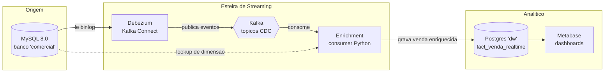

# Arquitetura e Funcionamento — Realtime Sales Streaming

Este documento explica, **passo a passo**, como o projeto funciona: do problema de
negócio à lógica de código, passando por cada container Docker. A ideia é que, ao
terminar de ler, você consiga explicar o pipeline inteiro para outra pessoa.

---

## 1. O problema que estamos resolvendo

Imagine uma operação comercial de seguros (viagem, celular, residencial, saúde).
Vendedores recebem leads, entram em contato e fecham vendas. Cada venda carrega um
**cupom** — e cada cupom pertence a um **vendedor**. O sistema de vendas grava tudo
num banco **MySQL** (a "produção").

A pergunta de negócio é: **como ter uma visão das vendas do comercial atualizada em
tempo real**, já com a venda atribuída ao vendedor certo, ao canal (tipo de seguro) e
ao valor — sem ficar rodando relatórios manuais nem sobrecarregando o banco de produção?

A resposta é um **pipeline de streaming**: toda vez que uma venda nasce (ou muda) no
MySQL, essa mudança flui automaticamente por uma esteira que a enriquece e a entrega,
em menos de um segundo, num banco analítico pronto para o Metabase montar dashboards.

---

## 2. Os conceitos-chave (a "mágica" explicada)

Antes de olhar os containers, três conceitos sustentam tudo:

### CDC — Change Data Capture
Em vez de "perguntar" ao MySQL de tempos em tempos "tem venda nova?" (polling, que é
lento e pesado), nós **lemos o binlog** — o log interno onde o MySQL registra toda
alteração de dados (INSERT/UPDATE/DELETE) para fins de replicação. Cada mudança vira um
evento. Isso é **Change Data Capture**: capturar a mudança na origem, no instante em que
acontece, sem tocar na aplicação.

### Debezium
É a ferramenta que **lê o binlog do MySQL e transforma cada mudança num evento JSON**.
Ele se conecta ao MySQL como se fosse uma réplica, recebe o fluxo de alterações e publica
cada uma como uma mensagem. O Debezium roda dentro do **Kafka Connect**.

### Kafka + Streaming Enrichment
O **Kafka** é o "correio" no meio do caminho: um sistema de mensagens onde os eventos
ficam organizados em **tópicos** (uma fila por tabela). Quem produz (Debezium) e quem
consome (nosso serviço Python) ficam desacoplados — se o consumidor cair, as mensagens
esperam no Kafka.

**Enrichment** ("enriquecimento") é o passo onde pegamos o evento cru de uma venda
(que só tem `cupom_id`, `produto_id`, `valor`...) e o completamos com os dados legíveis:
nome do vendedor, código do cupom, nome e canal do produto. É aí que mora a lógica de
negócio do projeto.

---

## 3. Visão geral da arquitetura



O fluxo tem três grandes blocos:
1. **Origem** — o MySQL de produção (aqui, um MySQL local com dados fake).
2. **Esteira de streaming** — Debezium captura, Kafka transporta, o consumer enriquece.
3. **Analítico** — Postgres guarda o resultado, Metabase visualiza.

---

## 4. Os containers, um a um

Tudo sobe com um único `docker compose up -d`. São **7 serviços**. Vamos ver o papel de
cada um e por que ele existe.

### 4.1 `mysql` — a fonte (porta 3306)
É o banco de "produção" do POC. O que o torna especial não são os dados, mas a
**configuração para CDC**, no `command` do compose:

```yaml
--server-id=1              # identidade unica (necessario para replicacao)
--log-bin=mysql-bin        # LIGA o binlog (o log de alteracoes)
--binlog_format=ROW        # registra cada LINHA alterada (nao o comando SQL)
--binlog_row_image=FULL    # grava a linha inteira (antes e depois)
--gtid_mode=ON             # identificadores globais de transacao
--enforce_gtid_consistency=ON
```

Sem `log-bin` e `binlog_format=ROW`, o Debezium não teria o que ler. Os scripts em
`mysql/init/` (schema + seed + usuário `debezium`) rodam **automaticamente** na primeira
inicialização, porque o MySQL executa tudo que está em `/docker-entrypoint-initdb.d`.

O usuário `debezium` recebe as permissões mínimas de replicação
(`REPLICATION SLAVE`, `REPLICATION CLIENT`, `SELECT`, `RELOAD`, `SHOW DATABASES`) — é com
ele que o Debezium se conecta.

### 4.2 `kafka` — o transporte (porta 9092)
Kafka na versão **KRaft** (sem Zookeeper — ele mesmo gerencia o cluster, mais simples).
Guarda os eventos em tópicos. Repare nos dois "endereços":
- `kafka:29092` — usado **dentro** da rede Docker (Debezium, enrichment, kafka-ui).
- `localhost:9092` — usado **de fora**, se você quiser conectar da sua máquina.

Essa dupla configuração (advertised listeners) é o detalhe que costuma confundir quem
começa com Kafka: o broker precisa anunciar um endereço que o cliente consiga alcançar,
e esse endereço é diferente para quem está dentro ou fora do Docker.

### 4.3 `kafka-connect` — onde o Debezium roda (porta 8083)
Imagem `debezium/connect:2.7.3.Final`. O Kafka Connect é um framework de conectores; o
Debezium é um **plugin** dele. Ele expõe uma **API REST** na porta 8083 — é por ela que
"registramos" o connector (dizemos: conecte nesse MySQL, capture essas tabelas).

Ele guarda o próprio estado em tópicos internos do Kafka (`connect_configs`,
`connect_offsets`, `connect_statuses`) — inclusive **até onde já leu do binlog**, para
retomar do ponto certo se reiniciar.

### 4.4 `enrichment` — o cérebro do projeto (imagem custom)
É a **única imagem que buildamos** (a partir de `enrichment/Dockerfile`). Um serviço
Python que consome os tópicos do Kafka, aplica a lógica de negócio e grava no Postgres.
A seção 6 detalha a lógica dele.

### 4.5 `postgres` — o data warehouse (porta 5432)
O destino analítico. Tem uma única tabela relevante: `comercial.fact_venda_realtime`,
já com tudo "mastigado" (nome do vendedor, canal, valor...). É a tabela que o Metabase lê.
No POC usamos Postgres como "DW de mentira"; em produção isso vira o Redshift real (ver
seção 9).

### 4.6 `metabase` — a visualização (porta 3000)
Ferramenta de BI. Conecta no Postgres e monta dashboards/perguntas em cima da
`fact_venda_realtime`. É a "cara" que o time comercial enxerga.

### 4.7 `kafka-ui` — a janela de inspeção (porta 8080)
Interface web para **ver os tópicos e as mensagens** fluindo. Não faz parte do pipeline;
é uma ferramenta de observabilidade para você abrir e entender o que está acontecendo por
dentro do Kafka.

---

## 5. O caminho de uma venda (passo a passo)

Vamos seguir **uma única venda** desde o INSERT até o dashboard. Suponha:

```sql
INSERT INTO vendas (cupom_id, produto_id, valor, status)
VALUES (2, 3, 275.50, 'confirmada');
```

1. **MySQL grava a linha** na tabela `vendas` e, como o binlog está ligado, registra
   esse INSERT no `mysql-bin` (com a linha inteira, graças ao `ROW`/`FULL`).

2. **Debezium lê o binlog** quase instantaneamente, percebe a nova linha e monta um
   evento JSON. O campo importante é o `after` (o estado da linha depois da mudança):
   ```json
   { "after": { "id": 4, "cupom_id": 2, "produto_id": 3,
                 "valor": "275.50", "status": "confirmada",
                 "criado_em": 1783193555000, "atualizado_em": 1783193555000 } }
   ```

3. **Debezium publica** esse evento no tópico `comercial.comercial.vendas`. (O padrão do
   nome é `<prefixo>.<database>.<tabela>`.)

4. **O Kafka guarda** a mensagem no tópico, disponível para quem quiser consumir.

5. **O enrichment consome** a mensagem. Ele pega o `after`, vê que é uma venda, e precisa
   traduzir os IDs em nomes:
   - `cupom_id = 2` → busca o cupom → descobre `codigo = BRUNO10` e `vendedor_id = 2`.
   - `vendedor_id = 2` → busca o vendedor → `nome = Bruno Lima`.
   - `produto_id = 3` → busca o produto → `nome = Seguro Residencial Completo`,
     `canal = seguro_residencial`.

6. **O enrichment grava no Postgres** um registro completo em `fact_venda_realtime`,
   usando um **UPSERT** (`INSERT ... ON CONFLICT (venda_id) DO UPDATE`). Ou seja: se a
   venda ainda não existe, insere; se já existe (uma atualização de status, por exemplo),
   atualiza. Isso torna o processo **idempotente** — reprocessar a mesma venda não gera
   duplicata.

7. **O Metabase lê** a `fact_venda_realtime` e o dashboard reflete a venda nova.

Tudo isso, do INSERT ao Postgres, acontece em **menos de um segundo**.

---

## 6. A lógica de enriquecimento em detalhe

Este é o coração do projeto (`enrichment/consumer.py`). Ele resolve um problema sutil de
streaming, e vale entender o raciocínio.

### O que ele consome
O consumer se inscreve em **quatro tópicos**: `vendas`, `cupons`, `vendedores` e
`produtos`. Os três últimos são **dimensões** (dados de referência que mudam pouco); o
primeiro é o **fato** (o evento que importa em tempo real).

### O padrão "cache + fallback"
Para traduzir `cupom_id` em nome de vendedor, o consumer mantém **caches em memória** das
dimensões, alimentados pelo próprio CDC:

```python
vendedores_cache = {}   # id -> {nome, email, ...}
cupons_cache = {}       # id -> {codigo, vendedor_id, ...}
produtos_cache = {}     # id -> {nome, canal, ...}
```

Quando chega um evento de `cupons`, ele atualiza o `cupons_cache`. Assim, o cache reflete
mudanças em tempo real (ex.: um cupom reatribuído a outro vendedor).

**Mas há uma armadilha:** o Kafka **não garante ordem entre tópicos diferentes**. Uma
venda pode chegar ao consumer *antes* do evento do cupom dela ter sido cacheado. Se
dependêssemos só do cache, o vendedor viria `None`.

A solução é o **fallback no MySQL**: em todo cache miss, o consumer busca a dimensão
direto na fonte da verdade:

```python
def get_cupom(mysql, cupom_id):
    if cupom_id not in cupons_cache:          # cache miss?
        row = _mysql_lookup(mysql, "cupons", cupom_id)  # busca no MySQL
        if row:
            cupons_cache[cupom_id] = row      # e guarda no cache
    return cupons_cache.get(cupom_id, {})
```

Resultado: o enriquecimento fica **correto independente da ordem** em que os eventos
chegam. O cache deixa o caminho comum rápido; o fallback garante a correção.

### Resiliência
Cada mensagem é processada dentro de um `try/except`: se uma der problema, o consumer
faz `rollback`, loga o erro e **segue para a próxima** — uma mensagem ruim não derruba o
pipeline inteiro.

### Um detalhe de timestamp
O Debezium entrega datas como **milissegundos desde 1970** (epoch). Por isso o SQL
converte com `to_timestamp(criado_em / 1000.0)` ao gravar no Postgres.

---

## 7. Dois problemas reais que enfrentamos (e como resolvemos)

Estes dois bugs apareceram durante a construção e são ótimos exemplos de "pegadinhas"
clássicas de CDC — por isso ficam documentados.

### 7.1 DECIMAL chegava como base64
O campo `valor` (tipo `DECIMAL` no MySQL) chegava como `"fQA="` em vez de `320.00`. Isso
acontece porque o modo padrão do Debezium para decimais é `precise`, que serializa o
número como **bytes** (para não perder precisão) — e em JSON esses bytes viram base64.

**Correção:** adicionamos `"decimal.handling.mode": "string"` na config do connector, para
o Debezium entregar decimais como texto legível (`"320.00"`), que o Postgres converte para
`numeric` sem perda.

### 7.2 Atribuição vindo `None`
Como explicado na seção 6: durante o snapshot inicial, as vendas eram processadas antes
das dimensões estarem cacheadas, e vinham sem vendedor/cupom/produto.

**Correção:** o padrão cache + fallback no MySQL, que torna a ordem irrelevante.

### Bônus de operação
Também ajustamos:
- **Healthchecks com `start_period: 180s`** no MySQL — no WSL a inicialização é lenta, e
  sem isso os serviços dependentes desistiam cedo demais.
- **Reset de offset do connector** quando recriamos os tópicos — o Debezium guarda "até
  onde leu"; ao apagar os tópicos, é preciso zerar esse ponteiro para ele re-snapshotar.

---

## 8. Estrutura de arquivos do projeto

```
realtime-sales-streaming/
├── docker-compose.yml          # orquestra os 7 servicos
├── .env.example                # modelo de variaveis (copie para .env)
├── mysql/init/
│   ├── 01-schema.sql           # tabelas + usuario debezium
│   └── 02-seed.sql             # dados de exemplo
├── postgres/init/
│   └── 01-schema.sql           # tabela destino fact_venda_realtime
├── connectors/
│   └── mysql-source.json       # config do connector Debezium
├── enrichment/
│   ├── consumer.py             # a logica de enriquecimento
│   ├── Dockerfile              # imagem custom do consumer
│   └── requirements.txt        # dependencias Python
├── scripts/
│   ├── register-connector.sh   # registra o connector via API REST
│   ├── seed-venda.sh           # gera vendas de teste
│   ├── watch-mysql.sh          # monitor ao vivo da fonte
│   └── watch-dw.sh             # monitor ao vivo do destino
├── README.md                   # guia rapido de uso
└── ARQUITETURA.md              # este documento
```

---

## 9. Como operar

### Subir do zero
```bash
cp .env.example .env
docker compose up -d --build
./scripts/register-connector.sh
```

### Ver o fluxo ao vivo
Abra dois terminais:
```bash
./scripts/watch-mysql.sh    # a fonte (MySQL)
./scripts/watch-dw.sh       # o destino (DW)
```
E num terceiro, gere vendas:
```bash
./scripts/seed-venda.sh 5
```

### Parar sem perder dados
```bash
docker compose stop         # para os containers, preserva volumes
docker compose start        # retoma no ponto exato
```

### Zerar tudo
```bash
docker compose down -v      # remove containers E volumes (apaga os dados)
```

### Inspecionar
- **Kafka UI:** http://localhost:8080 (tópicos e mensagens)
- **Metabase:** http://localhost:3000 (dashboards)
- **Status do connector:** `curl -s http://localhost:8083/connectors/comercial-mysql-connector/status`

---

## 10. Caminho para produção (Redshift)

O POC usa dados fake e Postgres. Para virar produção, os pontos de mudança são:

- **Fonte real:** apontar o connector (`connectors/mysql-source.json`) para uma **réplica
  de leitura** do MySQL de produção (nunca o primary, para não competir com a aplicação),
  com um usuário dedicado só de replicação.
- **Destino real:** trocar o `POSTGRES_DSN` do enrichment por uma conexão **Redshift** e
  criar a `fact_venda_realtime` no schema do DW existente. Em volume alto, prefira
  **staging + MERGE** em vez de upsert linha a linha (o Redshift não tem `ON CONFLICT`
  eficiente).
- **dbt:** expor a `fact_venda_realtime` como *source* no projeto dbt, para nascer
  documentada e testada junto do resto do catálogo.
- **Observabilidade:** monitorar o *lag* do consumer group `comercial-enrichment` para
  saber se o streaming está acompanhando a produção.

---

## Resumo em uma frase

**Toda mudança no MySQL vira um evento (Debezium/CDC), viaja por uma fila (Kafka), é
enriquecida com os dados do vendedor/cupom/produto (consumer Python) e aterrissa pronta
num data warehouse (Postgres/Redshift) que o Metabase transforma em dashboards — em tempo
real e sem tocar na aplicação de origem.**
